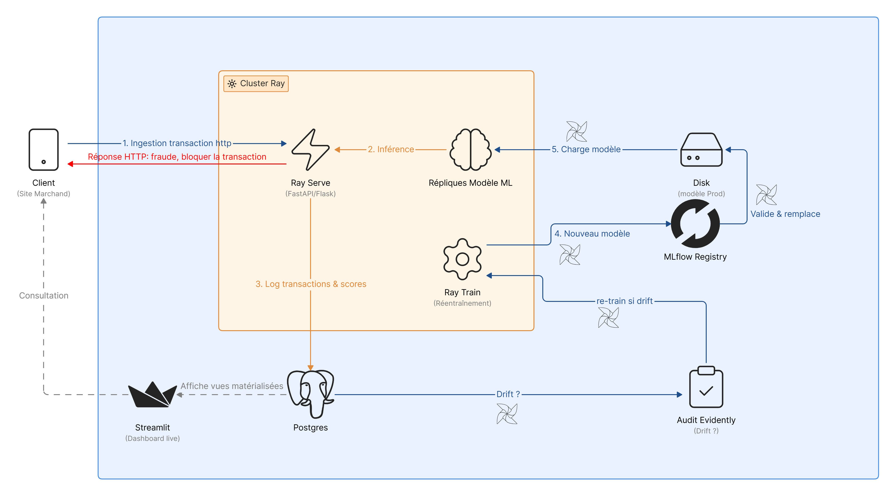
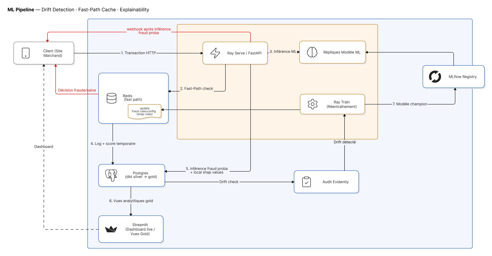

# Fraud detection MLOps pipeline

### Technical Stack
[](https://www.python.org/)
[](https://fastapi.tiangolo.com/)
[](https://streamlit.io/)
[](https://mlflow.org/)
[](https://www.ray.io/)
[](https://airflow.apache.org/)
[](https://www.getdbt.com/)
[](https://www.postgresql.org/)
[](https://redis.io/)
[](https://www.docker.com/)
[](https://github.com/features/actions)

Ce dépôt contient l'architecture logicielle complète pour le pipeline temps réel de détection de fraude et la boucle automatisée de drift/réentraînement.

---

## 📁 Architecture des dossiers

* 📂 **`dags/`** : DAGs Airflow d'orchestration (audit, drift, réentraînement et déploiement).
* 📂 **`dbt_project/`** : Transformations SQL et matérialisations analytiques (OLAP) dans Postgres.
* 📂 **`src/`** : Code source Python :
  * `api/` : FastAPI pour l'inférence temps réel et la réponse synchrone.
  * `training/` : Script d'entraînement distribué sur Ray Train.
  * `audit/` : Évaluation du drift statistique avec Evidently AI.
  * `dashboard/` : Application Streamlit pour le suivi en temps réel.
  * `utils/` : Utilitaires (alertes e-mail marchands).
* 📂 **`docker/`** : Configurations Docker pour la conteneurisation des services.
* 📂 **`tests/`** : Tests unitaires pour l'API et la détection de drift.

---

## 🏗️ Architecture du pipeline
shéma simplifié : ingestion, inférence, réentrainement



Schéma d'architecture complet du pipeline en temps réel, incluant le Fast-Path avec Redis Cache, le calcul d'explicabilité Shapash, et la boucle de drift/réentraînement :



---

## 🚀 Installation & lancement rapide

1. Installez les dépendances :
   ```bash
   pip install -r requirements.txt
   ```
2. Configurez les ports de votre infrastructure dans le fichier `docker-compose.yml` (ici décalés d'une unité pour éviter les conflits locaux).
3. Lancez l'infrastructure locale :
   ```bash
   docker compose up -d --build
   ```
4. Accédez aux interfaces :
   * **FastAPI (Swagger)** : `http://localhost:8081/docs` (Via le port d'Airflow si redirigé ou le port API configuré)
   * **Streamlit** : `https://fraud-detection.ngrok.app/` ou `http://localhost:8511`
   * **MLflow** : `http://localhost:5001`
   * **Ray Dashboard** : `http://localhost:8266`
   * **Airflow Web** : `http://localhost:8081`

---

## 🔒 Détection de drift & auto-healing

La boucle automatique d'Airflow effectue quotidiennement les tâches suivantes :
1. **Audit** : `dags/drift_and_retrain.py` appelle `src/audit/drift_analysis.py`.
2. **Réentraînement** : Si la dérive des données est supérieure au seuil Evidently, `src/training/train.py` est lancé sur le cluster Ray.
3. **Mise à jour** : Le modèle est versionné dans MLflow, sauvegardé sur disque et automatiquement rechargé par FastAPI.

## Liens et demo

• FastApi : http://localhost:8001/docs#/
• Dashboard : https://fraud-detection.ngrok.app/
• Airflow : http://localhost:8082/
• MLFlow : http://127.0.0.1:5001/#/
Batch ingestion : https://drive.google.com/file/d/1w0A6XtAlBXip9RwaOSHs-L9cPTOmzCM_/view?usp=sharing
