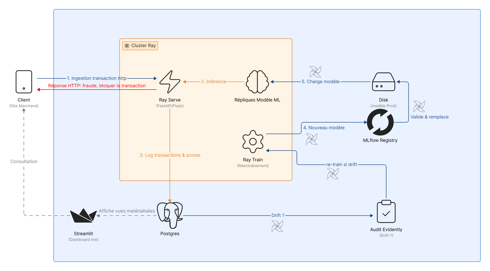
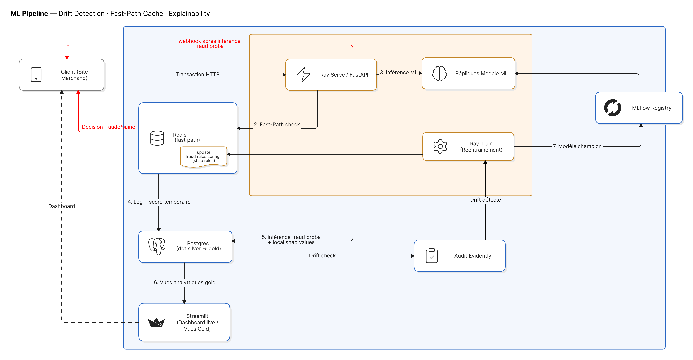

# Fraud detection MLOps pipeline

### Technical Stack
[](https://www.python.org/)
[](https://fastapi.tiangolo.com/)
[](https://streamlit.io/)
[](https://mlflow.org/)
[](https://www.ray.io/)
[](https://airflow.apache.org/)
[](https://www.getdbt.com/)
[](https://www.postgresql.org/)
[](https://redis.io/)
[](https://www.docker.com/)
[](https://github.com/features/actions)

Ce dépôt contient l'architecture logicielle complète pour le pipeline temps réel de détection de fraude et la boucle automatisée de drift/réentraînement.

---

## 📁 Architecture des dossiers

* 📂 **`dags/`** : DAGs Airflow d'orchestration (audit, drift, réentraînement et déploiement).
* 📂 **`dbt_project/`** : Transformations SQL et matérialisations analytiques (OLAP) dans Postgres.
* 📂 **`src/`** : Code source Python :
  * `api/` : FastAPI pour l'inférence temps réel et la réponse synchrone.
  * `training/` : Script d'entraînement distribué sur Ray Train.
  * `audit/` : Évaluation du drift statistique avec Evidently AI.
  * `dashboard/` : Application Streamlit pour le suivi en temps réel.
  * `utils/` : Utilitaires (alertes e-mail marchands).
* 📂 **`docker/`** : Configurations Docker pour la conteneurisation des services.
* 📂 **`tests/`** : Tests unitaires pour l'API et la détection de drift.

---

## 🏗️ Architecture du pipeline
shéma simplifié : ingestion, inférence, réentrainement



Schéma d'architecture complet du pipeline en temps réel, incluant le Fast-Path avec Redis Cache, le calcul d'explicabilité Shapash, et la boucle de drift/réentraînement :



---

## 🚀 Installation & lancement rapide

1. Installez les dépendances :
   ```bash
   pip install -r requirements.txt
   ```
2. Configurez les ports de votre infrastructure dans le fichier `docker-compose.yml` (ici décalés d'une unité pour éviter les conflits locaux).
3. Lancez l'infrastructure locale :
   ```bash
   docker compose up -d --build
   ```
4. Accédez aux interfaces :
   * **FastAPI (Swagger)** : `http://localhost:8081/docs` (Via le port d'Airflow si redirigé ou le port API configuré)
   * **Streamlit** : `https://fraud-detection.ngrok.app/` ou `http://localhost:8511`
   * **MLflow** : `http://localhost:5001`
   * **Ray Dashboard** : `http://localhost:8266`
   * **Airflow Web** : `http://localhost:8081`

---

## 🔒 Détection de drift & auto-healing

La boucle automatique d'Airflow effectue quotidiennement les tâches suivantes :
1. **Audit** : `dags/drift_and_retrain.py` appelle `src/audit/drift_analysis.py`.
2. **Réentraînement** : Si la dérive des données est supérieure au seuil Evidently, `src/training/train.py` est lancé sur le cluster Ray.
3. **Mise à jour** : Le modèle est versionné dans MLflow, sauvegardé sur disque et automatiquement rechargé par FastAPI.

## ⚖️ Gouvernance MLOps & Règles de Promotion (`@champion`)

Le cycle de vie et le déploiement des modèles s'appuient sur une gouvernance stricte de type **Champion vs Challenger** via le [MLflow Model Registry](https://mlflow.org/) et la classe centrale [`MLflowQualityGate`](src/utils/mlflow_manager.py) :

```
                 ┌─────────────────────────────────────────┐
                 │    Nouvel Entraînement / Réentraînement │
                 │   (XGBoost, GNN HinSAGE, etc.)          │
                 └───────────────────┬─────────────────────┘
                                     │
                                     ▼
                 ┌─────────────────────────────────────────┐
                 │ Calibration du Seuil τ sur Validation   │
                 │ & Évaluation Complète sur Test Set      │
                 └───────────────────┬─────────────────────┘
                                     │
                                     ▼
                 ┌─────────────────────────────────────────┐
                 │         Quality Gate MLOps              │
                 │  Score_Candidat > Score_Champion ?      │
                 └──────────────┬──────────────────┬───────┘
                     OUI        │                  │ NON
            ┌───────────────────┘                  └───────────────────┐
            ▼                                                          ▼
┌───────────────────────────────────────┐            ┌───────────────────────────────────┐
│ 👑 Promotion Automatique              │            │ 🥊 Challenger Conservé            │
│ • Alias '@champion' réassigné         │            │ • Version loggée dans MLflow      │
│ • Signal Hot-Reload vers FastAPI      │            │ • Modèle Champion actuel conservé │
└───────────────────────────────────────┘            └───────────────────────────────────┘
```

### 1. Métriques Cibles d'Évaluation
Lors de l'optimisation bayésienne (Optuna) ou de l'entraînement final, la métrique cible peut être spécifiée via l'argument `--metric-target` :
* **`f2` (Défaut pour la fraude)** : Privilégie le rappel ($\beta=2.0$) pour minimiser les faux négatifs (fraudes manquées) tout en maintenant une précision acceptable.
* **`f1`** : Moyenne harmonique équilibrée entre précision et rappel.
* **`auprc` / `pr_auc`** : Aire sous la courbe Précision-Rappel (*Area Under Precision-Recall Curve*), métrique de référence pour les jeux de données déséquilibrés.
* **`roc_auc`**, **`recall`**, **`precision`**.

### 2. Évaluation Comparative Side-by-Side
Pour garantir une comparaison équitable :
1. Le modèle candidat est testé sur le jeu de test holdout récent.
2. Si le Champion actuel est disponible, il est évalué **sur le même jeu de test** (*Side-by-Side comparison*).
3. Si le candidat surpasse le score du champion actuel sur la métrique cible :
   * L'alias **`@champion`** lui est automatiquement attribué dans MLflow.
   * L'API FastAPI reçoit un signal d'auto-reload pour charger immédiatement la nouvelle version sans interruption de service.
4. Dans le cas contraire, le modèle est enregistré comme **Challenger** et le Champion en production reste inchangé.

### 3. Gestion manuelle et Rollback CLI
La gouvernance permet également d'inspecter et de rétrograder/promouvoir manuellement n'importe quelle version :
```bash
# Inspection de l'état du registre et du champion actif
python src/utils/mlflow_manager.py

# Promotion / Rollback manuel vers une version spécifique (ex: version 3)
python src/utils/mlflow_manager.py --set-version 3
```

---

## 🎯 Calibration Dynamique des Seuils & Inférence Probabiliste (`predict_proba`)

En détection de fraude bancaire (déséquilibre sévère, ~0.4% de fraude), un seuil de décision arbitraire (ex: 0.50 ou 0.15 codé en dur) dégrade considérablement les performances opérationnelles. Le projet intègre un module de **Threshold Tuning** universel ([`src/utils/threshold.py`](src/utils/threshold.py)).

### 1. Optimisation du Seuil de Décision ($\tau$)
À la fin de chaque entraînement :
1. Le modèle calcule les probabilités d'appartenance à la classe positive : $\hat{p} = P(\text{fraude} \mid X) \in [0, 1]$ via `predict_proba`.
2. La fonction `find_optimal_threshold()` balaie la courbe Précision-Rappel pour localiser le seuil $\tau^* \in [0.05, 0.95]$ maximisant la métrique choisie ($F_2$, $F_1$, $F_\beta$ ou matrice de coût).
3. La fonction `evaluate_predictions_and_curves()` calcule à la fois :
   * Les métriques intrinsèques au modèle (AUPRC, ROC-AUC).
   * Les métriques opérationnelles appliquées au seuil optimal $\tau^*$ (Précision, Rappel, F1, F2, Matrice de confusion).

### 2. Traçabilité & Persistance dans MLflow
* Le seuil calibré $\tau^*$ est tracé dans les **paramètres** et **métriques** de l'expérience MLflow (`decision_threshold`).
* Il est stocké de manière intrinsèque avec les métadonnées de la version du modèle.

### 3. Inférence Temps Réel & Dynamic Serving (FastAPI)
* L'API ([`src/api/main.py`](src/api/main.py)) utilise la fonction agnostique `load_champion_model()` pour charger simultanément :
  1. Le pipeline de transformation et le modèle ML (`@champion`).
  2. L'identifiant de version MLflow (ex: `fraud_detector_v12`).
  3. Le **seuil de décision optimal calibré** $\tau^*$ associé.
* Lors d'une requête d'inférence `/predict_batch` :
  $$\text{Prédiction} = \begin{cases} 1 \text{ (Fraude)} & \text{si } P(\text{fraude} \mid X) \ge \tau^* \\ 0 \text{ (Légitime)} & \text{sinon} \end{cases}$$
* Les endpoints `/model-info` et `/metrics` exposent dynamiquement la version active et la valeur de $\tau^*$ en production.

## 🛡️ Conformité réglementaire & Sécurité (RGPD, AI Act, PCI-DSS)

Notre pipeline intègre les contraintes de sécurité et de conformité réglementaires par design :

* **PCI-DSS (Données bancaires)** : 
  * Les numéros de cartes de crédit (`cc_num`) sont hachés de manière irréversible avec l'algorithme cryptographique **SHA-256** (`cc_num_sha256`) avant tout affichage dans le Dashboard Streamlit, écriture dans les logs, ou transmission dans le corps des webhooks marchands.
* **RGPD (Données personnelles)** :
  * **Minimisation des données (Art. 5)** : Le stockage des contributions locales SHAP est **sélectif**. Les transactions saines (99% du trafic) sont enregistrées avec la valeur `NULL` en base PostgreSQL, évitant la constitution automatique de profils comportementaux de masse inutiles.
  * **Durée de conservation (Rétention)** : Les alertes webhooks en temps réel enregistrées dans le cache Redis appliquent une politique d'expiration stricte de **24 heures glissantes**.
  * **Droit à l'explication (Art. 22)** : L'application Streamlit intègre les explications locales **Shapash** (graphique Waterfall Plotly) pour justifier et retracer de manière compréhensible chaque décision automatisée de blocage ou d'alerte.
* **AI Act (Régulation européenne de l'IA)** :
  * **Transparence & Robustesse** : Le système surveille de façon continue la dérive des données de production (**Evidently AI**) comparant les transactions du jour à une période de référence glissante de 30 jours pour prévenir la dégradation des performances.
  * **Contrôle Humain & Traçabilité** : L'explicabilité locale et le suivi rigoureux de toutes les métadonnées d'entraînement et d'évaluation dans **MLflow** garantissent la traçabilité complète des versions du modèle champion promues en production.

---

## Liens et demo

• FastApi : http://localhost:8001/docs#/
• Dashboard : https://fraud-detection.ngrok.app/
• Airflow : http://localhost:8082/
• MLFlow : http://127.0.0.1:5001/#/
Batch ingestion : https://drive.google.com/file/d/1w0A6XtAlBXip9RwaOSHs-L9cPTOmzCM_/view?usp=sharing
