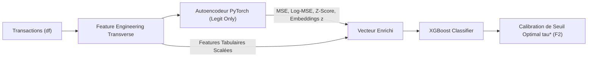
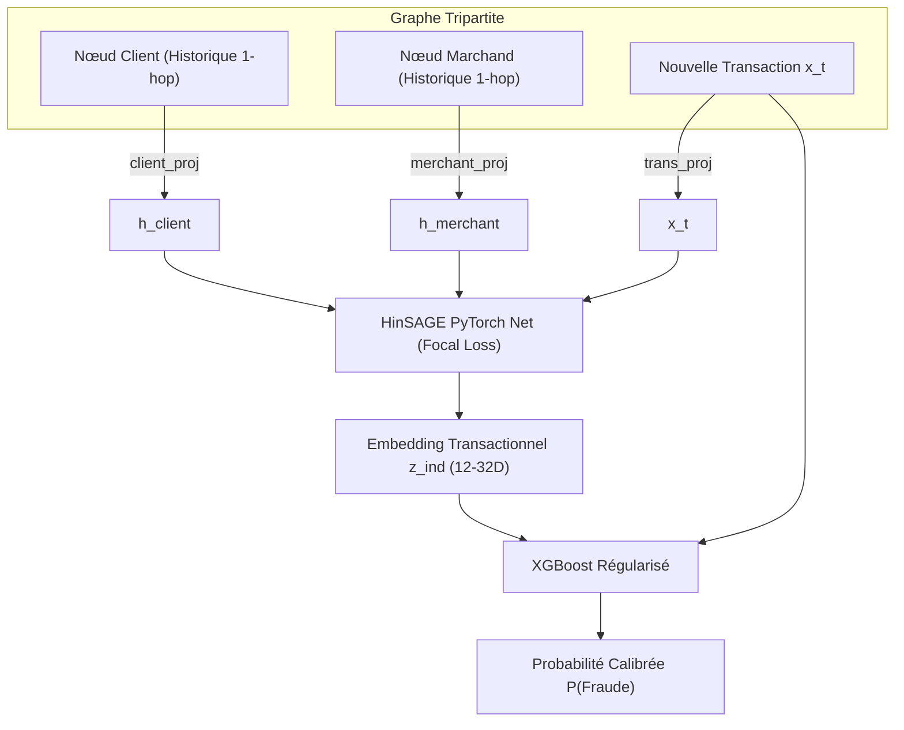

# Guide MLOps : Optimisation des Hyperparamètres (HPO) des Modèles de Fraude

Ce document détaille la démarche théorique, méthodologique et technique mise en œuvre pour circonscrire et automatiser la recherche d'hyperparamètres (HPO via Optuna & MLflow) pour les deux architectures avancées du projet :
1. **Modèle 1 : Hybride Autoencodeur + XGBoost (`AutoencoderXGBoostPipeline`)**
2. **Modèle 2 : Inductive Graph Representation Learning (`InductiveGRLPipeline` - HinSAGE + XGBoost)**

---

## 1. Contexte Métier & Objectifs d'Optimisation

Le flux transactionnel présente un déséquilibre de classes extrême ($< 0.5\%$ de transactions frauduleuses). Dans ce contexte :
- **Métrique Cible Principale** : $F_2$-Score (priorité au Rappel de la classe 1 tout en maintenant une précision acceptable).
- **Contraintes** :
  - Inférence temps réel avec latence $< 50\text{ ms}$.
  - Absence de *Train-Serving Skew* via un module unifié [`src/utils/features.py`](file:///C:/Users/Admin/Documents/certif/bloc3/src/utils/features.py).
  - Étalonnage automatique du seuil de décision optimal $\tau^*$.

---

## 2. Modèle 1 : Hybride Autoencodeur + XGBoost

### 2.1. Fondement Théorique & Architecture
L'Autoencodeur PyTorch (`AutoencoderFraudDetector`) est entraîné de manière **semi-supervisée exclusivement sur la classe légitime** ($y=0$). Il apprend le sous-espace normal des comportements d'achat.

Pour chaque transaction $x$, le module extrait :
1. L'erreur quadratique de reconstruction : $\text{MSE}(x, \hat{x}) = \|x - \hat{x}\|_2^2$
2. L'erreur logarithmique stabilisée : $\log(1 + \text{MSE})$
3. Le score d'anomalie normalisé : $Z\text{-score} = \frac{\text{MSE} - \mu_{\text{loss}}}{\sigma_{\text{loss}}}$
4. Le vecteur d'état latent comprimé : $z \in \mathbb{R}^d$ ($d \in [12, 24]$)

Ces descripteurs d'anomalie sont concaténés aux features tabulaires (distances géographiques Haversine, composantes cycliques d'heure/jour/mois, démographie) et injectés dans un classifieur `XGBClassifier`.



### 2.2. Espace de Recherche Optuna (Autoencodeur + XGBoost)

| Composant | Hyperparamètre | Espace / Distribution | Rôle & Justification |
| :--- | :--- | :--- | :--- |
| **Autoencodeur** | `latent_dim` | `Categorical([12, 16, 24])` | Taille de la représentation compressée sans perte d'information. |
| **Autoencodeur** | `hidden_dim` | `Categorical([32, 48, 64])` | Capacité des couches intermédiaires d'encodage/décodage. |
| **Autoencodeur** | `lr` & `epochs` | `lr=0.003`, `epochs=12` | Convergence rapide et stable sur GPU/CPU avec AdamW. |
| **XGBoost** | `max_depth` | `Int(5, 10)` | Profondeur équilibrée pour capter l'interaction tabular + reconstruction. |
| **XGBoost** | `n_estimators` | `Int(140, 280, step=20)` | Nombre d'arbres adapté à un pas d'apprentissage modéré. |
| **XGBoost** | `learning_rate` | `Float(0.015, 0.08, log=True)` | Évite le surajustement tout en convergeant en $< 250$ arbres. |
| **XGBoost** | `scale_pos_weight` | `Float(2.0, 6.0)` | Pondération des fraudes ; le seuil $\tau^*$ finalise la sensibilité. |
| **XGBoost** | `gamma` | `Float(2.0, 7.5)` | Pénalisation des divisions d'arbres non informatives. |
| **XGBoost** | `min_child_weight` | `Int(2, 6)` | Évite la mémorisation d'exemples anormaux isolés. |
| **XGBoost** | `colsample_bytree` | `Float(0.70, 0.85)` | Sous-échantillonnage des colonnes pour diversifier les arbres. |
| **XGBoost** | `reg_alpha` | `Float(1e-5, 0.1, log=True)` | Régularisation Lasso L1 sur les feuilles. |
| **XGBoost** | `reg_lambda` | `Float(0.1, 3.0, log=True)` | Régularisation Ridge L2 sur les poids d'arbres. |

### 2.3. Accélération par Mise en Cache
L'encodeur d'anomalie étant indépendant des hyperparamètres XGBoost :
- Le précalcul des features hybrides (erreurs + $z$) est réalisé **une seule fois** avant la boucle HPO XGBoost.
- Temps moyen par trial : **$\approx 0.35$ seconde**, permettant d'exécuter 50 trials en moins de 20 secondes.

---

## 3. Modèle 2 : Inductive Graph Representation Learning (HinSAGE + XGBoost)

### 3.1. Fondement Théorique & Architecture
L'architecture GRL modélise les interactions sous forme d'un **graphe hétérogène tripartite** :
- **Nœuds** : Clients $\mathcal{C}$, Marchands $\mathcal{M}$, Transactions $\mathcal{T}$.
- **Arêtes** : $(\mathcal{C} \leftrightarrow \mathcal{T})$ et $(\mathcal{M} \leftrightarrow \mathcal{T})$.
- **Agrégateur** : HinSAGE PyTorch (Heterogeneous GraphSAGE) avec agrégation de voisinage 2-hop et supervision par `FocalLoss` ($\alpha=0.80, \gamma=2.0$).
- **Propriété Inductive** : Pour toute nouvelle transaction entrante, son embedding $z_{\text{ind}}$ est calculé à la volée à partir des statistiques glissantes de son client et marchand sans ré-entraîner le graphe global.



### 3.2. Diagnostic de la Version V24 & Recalibrage (V31)

L'audit des premiers entraînements (Run V24) a révélé deux goulots d'étranglement majeurs :
1. **Saturation de `max_depth` à $7$** (plage initiale $[3, 7]$) $\rightarrow$ *L'arbre était tronqué artificiellement.*
2. **Saturation de `learning_rate` à $0.039$** (plage initiale $[0.03, 0.15]$) $\rightarrow$ *Tendance nette vers des pas plus lents.*
3. **Absence de régularisation structurelle** (`gamma`, `min_child_weight`, `colsample_bytree`) $\rightarrow$ *Risque de surapprentissage sur les petits sous-graphes.*

### 3.3. Espace de Recherche Recalibré (V31)

| Composant | Hyperparamètre | Plage Initiale (V24) | Espace Recalibré (V31) | Effet Technique |
| :--- | :--- | :--- | :--- | :--- |
| **GNN** | `embedding_size` | `[16, 32, 64]` | **`Categorical([12, 16, 24, 32])`** | Évite la sur-paramétrisation sur les nœuds rares. |
| **GNN** | `hidden_dim` | Fixé à 64 | **`2 * embedding_size`** | Maintient une compression symétrique. |
| **GNN** | `epochs` | Fixé à 6 | **`8` (avec Focal Loss)** | Convergence optimale sans surapprentissage du graphe. |
| **XGBoost** | `max_depth` | `[3, 7]` *(saturé)* | **`Int(6, 11)`** | Capture les croisements d'embeddings multi-hop. |
| **XGBoost** | `n_estimators` | `[100, 250, pas=50]` | **`Int(180, 320, step=20)`** | Résolution fine couplée au pas d'apprentissage. |
| **XGBoost** | `learning_rate` | `[0.03, 0.15]` *(saturé)* | **`Float(0.012, 0.045, log=True)`** | Descente de gradient douce et généralisation robuste. |
| **XGBoost** | `scale_pos_weight` | `[1.5, 6.0]` | **`Float(2.0, 7.5)`** | Équilibrage du gradient sur la classe minoritaire. |
| **XGBoost** | `gamma` | $0.0$ | **`Float(3.0, 9.0)`** | Élagage drastique des branches peu discriminantes. |
| **XGBoost** | `min_child_weight` | $1$ | **`Int(3, 8)`** | Interdit les splits sur $1$ ou $2$ transactions isolées. |
| **XGBoost** | `colsample_bytree` | $1.0$ | **`Float(0.70, 0.85)`** | Force l'alternance features tabulaires / features graphe. |
| **XGBoost** | `reg_alpha` | $0.0$ | **`Float(1e-5, 0.1, log=True)`** | Régularisation L1 (parcimonie des coefficients). |
| **XGBoost** | `reg_lambda` | $1.0$ | **`Float(0.1, 4.0, log=True)`** | Régularisation L2 (stabilisation des prédictions). |

### 3.4. Cache Dynamique Multi-Dimensions
Dans [`src/training/demo_gnn.py`](file:///C:/Users/Admin/Documents/certif/bloc3/src/training/demo_gnn.py), un cache d'embeddings par dimension $\text{emb\_size} \in \{12, 16, 24, 32\}$ évite de ré-entraîner HinSAGE lorsque Optuna teste différents hyperparamètres XGBoost avec la même dimension latente :
- Entraînement HinSAGE : au maximum 4 fois au cours de l'étude.
- Durée par trial XGBoost : **$< 0.45$ seconde**.

---

## 4. Tableau Comparatif Synthétique

| Caractéristique | Autoencodeur + XGBoost | Inductive GRL (HinSAGE + XGBoost) |
| :--- | :--- | :--- |
| **Nature des features dérivées** | Score d'anomalie, reconstruction MSE, latent $z$ | Embeddings de voisinage relationnel (Client-Marchand) |
| **Paradigme d'apprentissage** | Semi-supervisé (sur classe légitime uniquement) | Supervisé par liens (Focal Loss) + Superposé XGBoost |
| **Nombre de paramètres optimisés** | 10 (2 GNN/AE + 8 XGBoost) | 11 (2 GNN/AE + 9 XGBoost) |
| **Régularisation clé** | `gamma` $\in [2, 7.5]$, `min_child_weight` $\in [2, 6]$ | `gamma` $\in [3, 9]$, `min_child_weight` $\in [3, 8]$, `colsample` $\in [0.7, 0.85]$ |
| **Seuil Calibré Moyen ($\tau^*$)** | Bas ($\approx 0.05 - 0.15$) car probabilités écrasées | Modéré à Élevé ($\approx 0.25 - 0.77$) selon `scale_pos_weight` |
| **Performance $F_2$ Typique** | **$\approx 0.72 - 0.86$** (Rappel très élevé) | **$\approx 0.60 - 0.75$** (Précision très élevée) |

---

## 5. Automatisation MLOps & Promotion en Production

1. **Recherche de Seuil Optimal** : Calcul systématique du seuil $\tau^*$ maximisant la métrique cible sur le Precision-Recall curve :
   $$\tau^* = \arg\max_{\tau} F_\beta(y_{\text{val}}, \hat{p} \ge \tau)$$
2. **Quality Gate MLflow (`MLflowQualityGate`)** : Comparaison *side-by-side* sur le jeu de test holdout entre le nouveau candidat et le `@champion` actuel.
3. **Hot Reload API** : Déclenchement automatique de `/reload-model` sur FastAPI si promotion.
4. **Synchronisation Redis** : Re-génération des règles de suspicion SHAP via [`src/explain/export_rules.py`](file:///C:/Users/Admin/Documents/certif/bloc3/src/explain/export_rules.py).

---

## 6. Commandes CLI pour Exécuter les Optimisations

### Optimisation Hybride Autoencodeur + XGBoost
```bash
docker exec -it fraud-detection-ray-head python src/training/optimize_autoencoder_xgb.py \
    --n-trials 50 \
    --sample-size -1 \
    --metric-target f2
```

### Optimisation Inductive GRL (HinSAGE + XGBoost)
```bash
docker exec -it fraud-detection-ray-head python src/training/demo_gnn.py \
    --n-trials 50 \
    --sample-size -1 \
    --metric-target f2
```
